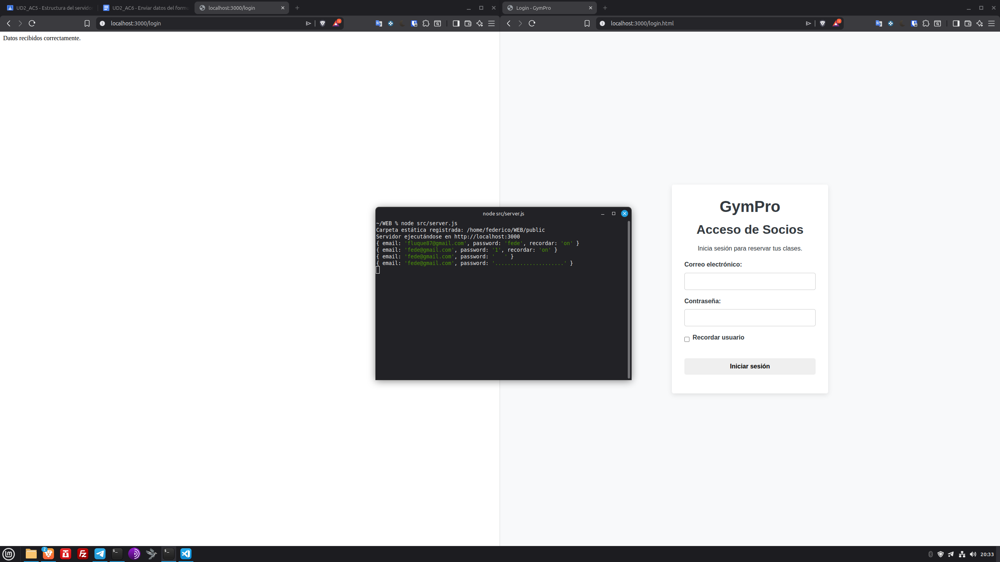

Federico Luque Santos
Node.js v22.18.0

La ruta POST del login en server.js recibe los datos del formulario.
Registra los datos recibidos y almacenados en req.body.

### Captura de pantalla

He aprendido como POST envia los datos al servidor y se almacenan en req.body.
No he tenido errores ni dificultades.