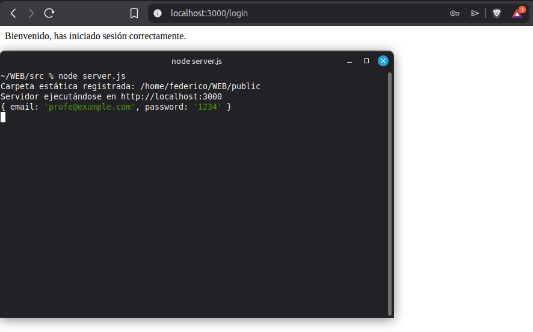
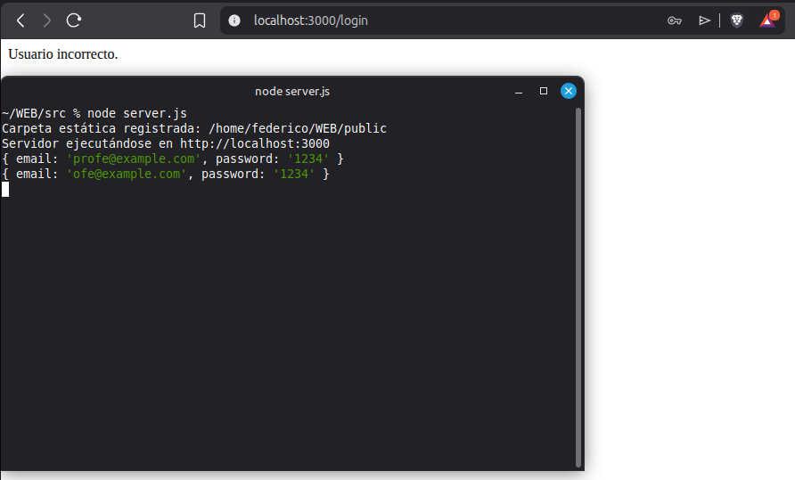
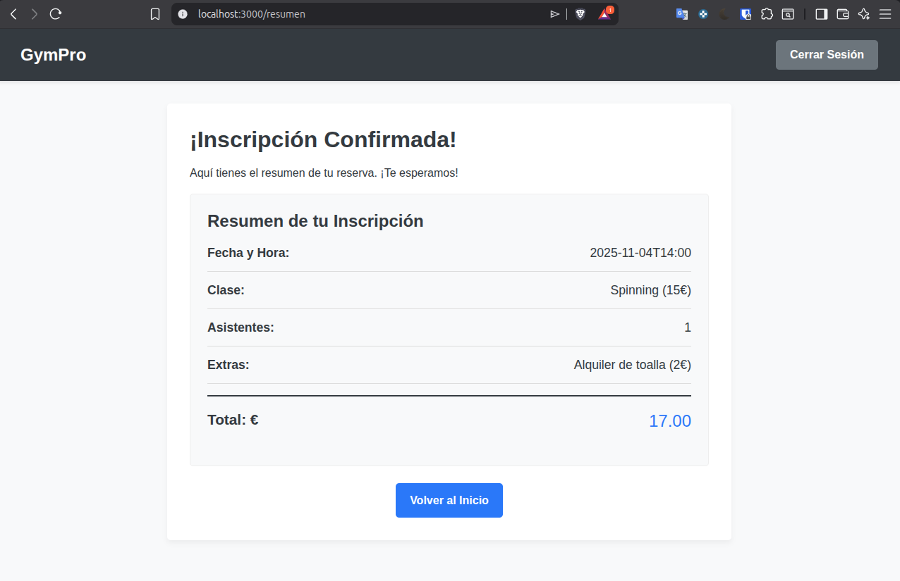
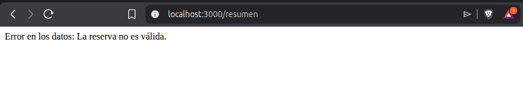
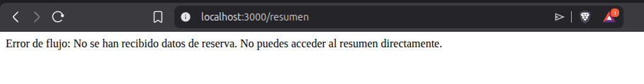

# Proyecto GymPro - Validación y Flujo de Datos

Este documento detalla la implementación del backend y las validaciones de flujo realizadas para la práctica.

## Especificaciones Técnicas
- **Versión de Node.js:** v22.18.0
- **Versión de Express:** ^5.1.0

## Análisis de la Ruta `POST /login`
La ruta `/login` gestiona la autenticación de los usuarios en el servidor.
- **Datos que procesa:** Recibe un objeto JSON/URL-encoded con los campos `email` y `password`.
- **Funcionamiento:** 
    1. Extrae las credenciales del cuerpo de la petición (`req.body`).
    2. Compara el email y la contraseña con valores predefinidos en el servidor (ej: `fede@fede.com` / `321`).
    3. Devuelve una respuesta personalizada dependiendo del caso: éxito total, usuario incorrecto, contraseña incorrecta o falta de datos.

## Pruebas de Funcionamiento (Capturas)

### Login Correcto

### Login Incorrecto

### Reserva Correcta

### Reserva con Errores

### Validación Adicional Obligatoria (Paso a Resumen)

## ¿Qué he aprendido en esta práctica?
He aprendido a integrar el flujo de navegación del frontend con la lógica de control del backend. He comprendido que el servidor es el responsable último de validar la integridad de los datos y de decidir qué vistas puede ver el usuario según el estado de su navegación. También he practicado el uso de rutas `POST` para proteger el acceso a archivos estáticos (como el resumen) asegurando que solo se entreguen si se cumplen ciertas condiciones.

## Dificultades y Resoluciones
- Dificultad: Al principio, la página de resumen se cargaba directamente por el navegador como un archivo estático, saltándose cualquier validación.
- Resolución: Modifiqué el servidor para que el archivo `resumen.html` no fuera entregado de forma pública directa, sino a través de una ruta `POST` que valida primero los datos de la reserva antes de usar `res.sendFile()`.

