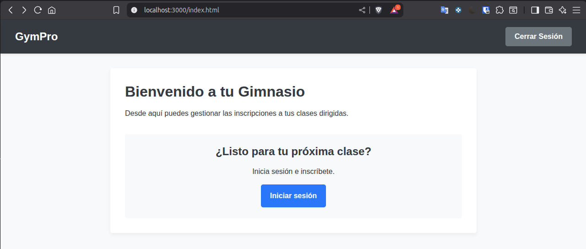
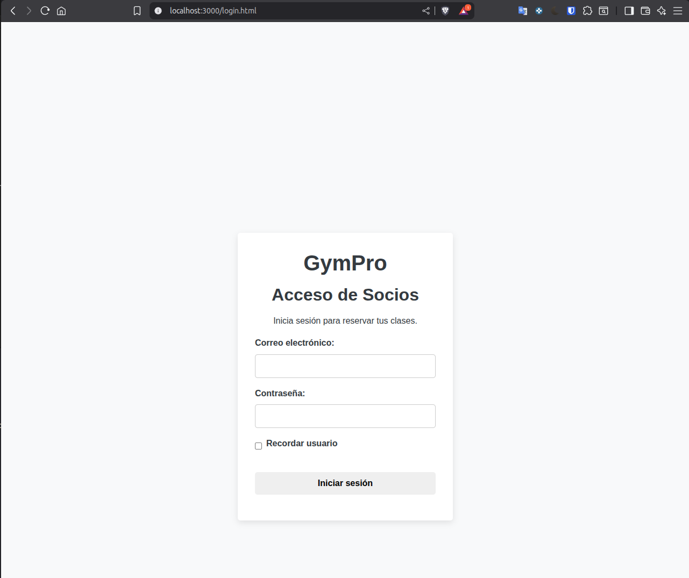
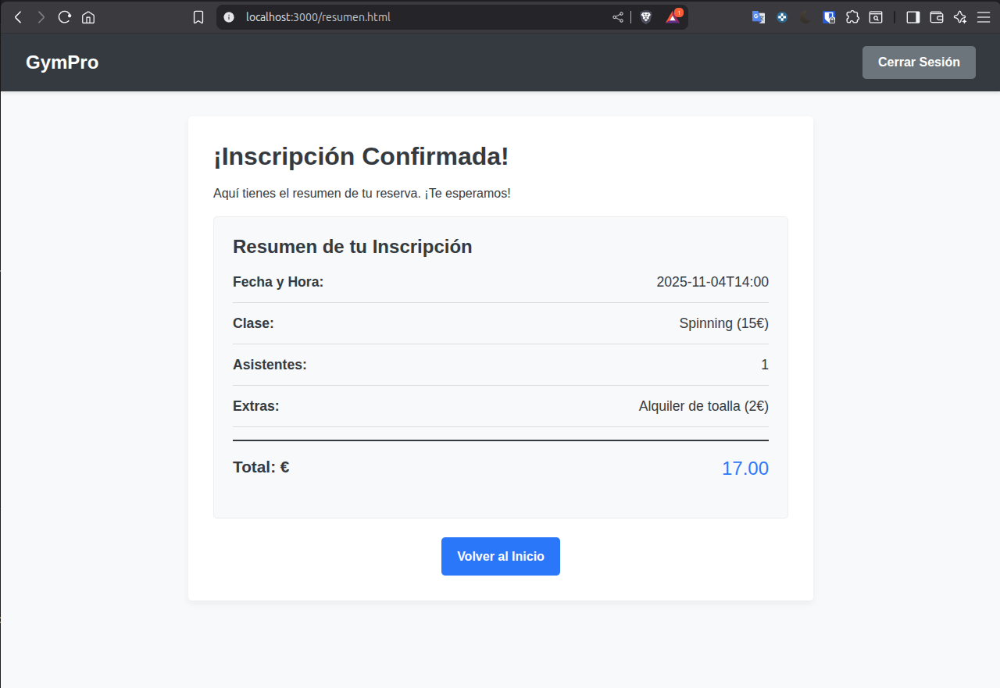

# Web de Inscripción (GymPro)

Este proyecto es un sistema de reservas de clases de gimnasio. Es una práctica para la asignatura de Desarrollo Web, centrada en HTML, CSS y JavaScript, que simula el flujo de un usuario desde el login hasta la confirmación de una reserva.

## Autor

 Federico Luque Santos

## Tecnologías Utilizadas

Node v22.18.0

Express 5.1.0

## Qué has aprendido en esta práctica

He aprendido para que sirve __dirname, fileURLToPath() y pathJoin(), y a usarlos correctamente.

## Capturas de pantalla

### Página de Inicio

### Página de Login

### Página de Reserva

### Página de Resumen

### Página 404

